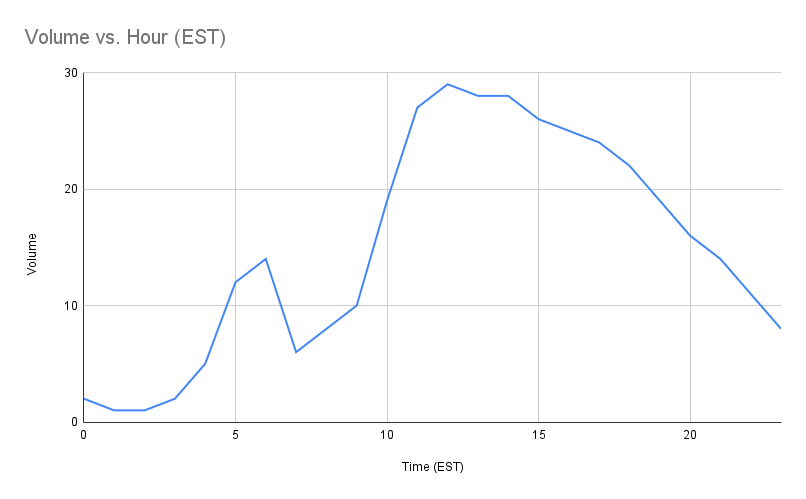

# SMTP Traffic Generator

A simple app to generate random traffic via SMTP towards a "sink".

## Pre-requisites
* Recent Python3. Version 3.10 is specified in the [`Pipfile`](Pipfile) - if you have a different version, adjust that file before starting.
* `pip`
* `pipenv`

Check your Python3 version with:
```
python3 --version
```

There are [various ways](https://pip.pypa.io/en/stable/installation/) to get pip for Python3. You may already have a version installed. The easiest on Linux is via `apt`. See [here](https://pip.pypa.io/en/stable/installation/) for other ways.
```
sudo apt install python3-pip
```
Use `pip` to get `pipenv`:
```
pip install --user pipenv
```

Check if your shell's startup `.profile` contains the following lines already. If it doesn't, paste them in.

```
# set PATH so it includes user's private bin if it exists
if [ -d "$HOME/bin" ] ; then
    PATH="$HOME/bin:$PATH"
fi

# set PATH so it includes user's private bin if it exists
if [ -d "$HOME/.local/bin" ] ; then
    PATH="$HOME/.local/bin:$PATH"
fi
```

To make this active, you will need to reload your shell's startup profile to get `pipenv` in your path:
```
. ~/.profile
```
Check this was successful with
```
pipenv --version
```
You should see output such as
```
pipenv, version 2023.3.20
```

## Installation

```
git clone https://github.com/tuck1s/smtp-traffic-gen.git
cd smtp-traffic-gen
pipenv install
pipenv shell
```

You're now in a shell with a Python [virtual environment](https://docs.python-guide.org/dev/virtualenvs/), with the necessary `Pipfile` dependencies installed. Check this by running

```
./smtp-traffic-gen.py --help
```

You should see output that looks like:

```
usage: smtp-traffic-gen.py [-h] --bounces BOUNCES --sender-subjects SENDER_SUBJECTS --html-content HTML_CONTENT --txt-content TXT_CONTENT --daily-volume DAILY_VOLUME [--yahoo-backoff YAHOO_BACKOFF]

Generate SMTP traffic with headers to cause some messages to bounce back from the sink

options:
  -h, --help            show this help message and exit
  --bounces BOUNCES     bounce configuration file (csv)
  --sender-subjects SENDER_SUBJECTS
                        senders and subjects configuration file (csv)
  --html-content HTML_CONTENT
                        html email content with placeholders
  --txt-content TXT_CONTENT
                        plain text email content with placeholders
  --daily-volume DAILY_VOLUME
                        daily volume
  --yahoo-backoff YAHOO_BACKOFF
                        Yahoo-specific bounce rates to cause backoff mode
```

## Safety first: block outbound port 25

Before sending traffic,  disable outbound port 25 to avoid messages leaving your server. Here's how to do that on Ubuntu, while allowing connections to your `localhost`.
```
sudo su -
apt-get install iptables-persistent
iptables -A OUTPUT -p tcp -s localhost --dport 25 -j ACCEPT
iptables -A OUTPUT -p tcp --dport 25 -j DROP
iptables-save >>/etc/iptables/rules.v4
```

You can test that you've blocked the port correctly by attempting an outbound connection e.g. to Gmail:
```
telnet alt1.gmail-smtp-in.l.google.com 25
```
You should just see a `Trying ..` line that hangs, with no handshake response.

While
```
telnet localhost 25
```
You should see:

```
Trying 127.0.0.1...
Connected to localhost.
Escape character is '^]'.
220 h4.espops.com ESMTP
```

## Running

> NOTE this will attempt to send mail to realistic looking destinations such as gmail.com, hotmail.com etc. Don't do this to an MTA that will actually deliver traffic - use a [sink](https://github.com/tuck1s/halon-sink) instead!

You can run this with the included data files as follows:
```
pipenv run ./smtp-traffic-gen.py --bounces demo_bounces.csv --sender-subjects sender_subjects.csv --html-content emailcontent.html --txt-content emailcontent.txt --daily-volume 150000 --yahoo-backoff 0.8
```

You should see output such as:

```
Getting 100 randomized real names from US 1990 census data
Done in 0.3s.
Yahoo backoff bounce probability 0.8
Sending 37 emails over max 20 SMTP connections, 100 max messages per connection
Done in 0.4s.
```

## Scheduling via `crontab`

There is a cronfile included, which will run the generator once per minute. Customize this to your needs. You can activate it with

```
crontab cronfile
```

## Traffic volume

This varies pseudo-randomly throughout the day, following a typical US East-Coast daily pattern, with a smaller bump for European senders.



## Bounce actions

Messages are generated with headers, e.g.

```
X-Bounce-Me: 421 4.7.0 [IPTS04] Messages from 134.192.128.54 temporarily deferred due to user complaints - 134.192.128.54; see https://mta1.mail.abc.yahoo.com/kb/postmaster/SLN3434.html

X-Bounce-Percentage: 40
```

The `X-Bounce-Me` header tells the [sink](https://github.com/tuck1s/halon-sink) what to do with this message.
The `X-Bounce-Percentage` header tells the sink to be probabilistic with bounces.

If a message _always_ bounced, tempfails (4xx) would cause many retries until eventual message expiry/delivery failure.
By making the messages only bounce _sometimes_, then tempfails have a chance to succeed on later delivery attempts.